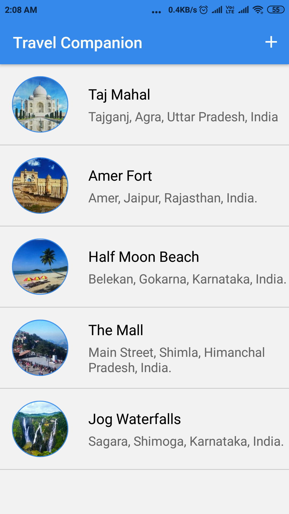
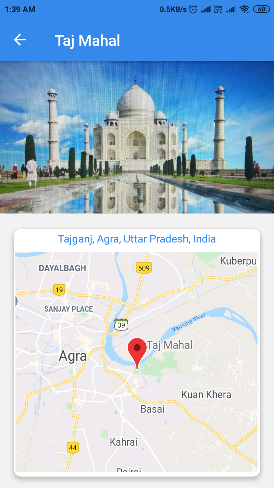
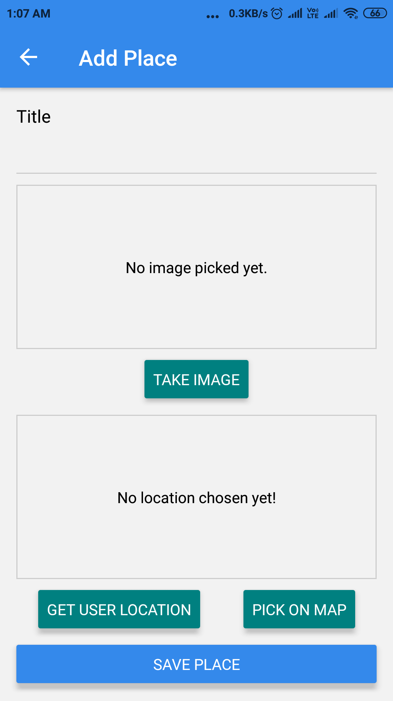
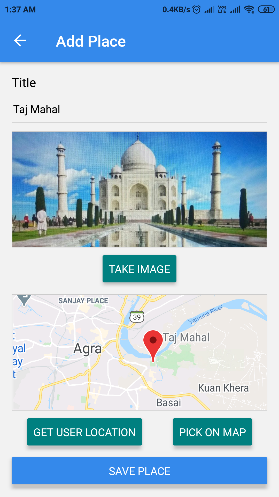
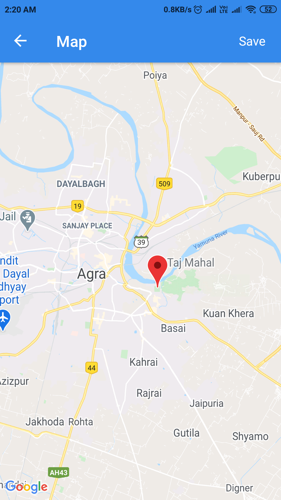

# Travel-Companion-App

**React Native based Mobile App that can Save Photos and Location Of Different Places.**

**User can add New Places by Clicking Photos from Device Camera And Add Location By Location Auto Detect or Choosing Location on Map.**

**User can later see the Photos And Location of the Different Places Saved On the App.**

**Project is made on top of Expo and implements Native Camera, Location Features, Maps and Mobile Memory Storage.**

  

 
